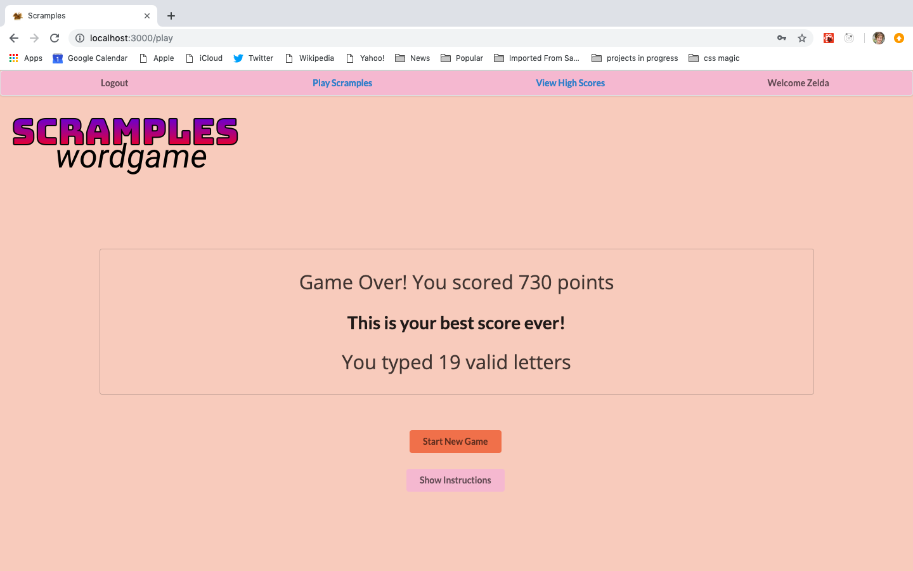

### Welcome to Scramples
Scramples is a fast, fun, and mobile friendly web app that supports the creation and authentication of player accounts and stores high scores and personal stats.

###Project Link
https://wwww.scramples.com

### Tech

* Frontend : React/Redux/Semantic-UI-React
* Backend : Node/Express/Knex/PSQL

### Installation Instructions

### 'git clone' 
this repository and the backend-repository at github.com/jkisk/capstone-backend

### 'npm install'

### `npm start`

###Screenshots

1. Create Player

2. Login Player

3. View Instructions

4. Play Game

5. End of Game

6. Top 30 High Scores from all players

